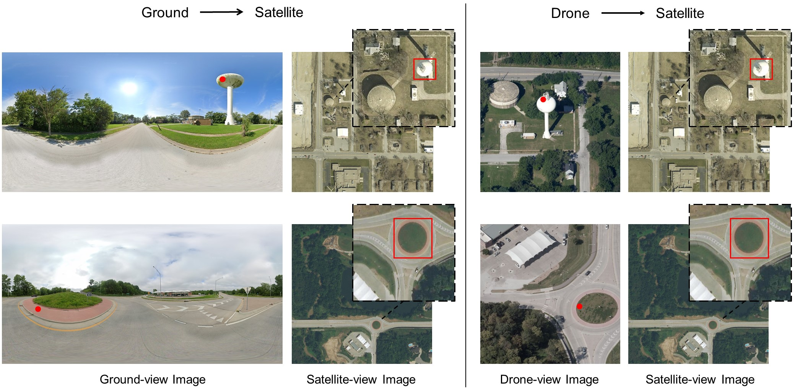

# Cross-view Object Geo-localization in a Local Region with Satellite Imagery

### Abstract
Cross-view geo-localization is a critical task in various applications, such as smart city management and disaster monitoring. Current methods typically divide a satellite image into patches and use these patches to identify the geographic location of a query image. However, these methods can only provide the location of an image rather than the location of a specific object of interest. This makes it difficult to link these methods to GeoDatabases to obtain detailed information about a target object, such as its name and construction time. To overcome this limitation, we propose a novel problem of cross-view object geo-localization in a local region with high-resolution satellite images. This problem includes two main challenges: accurately identifying the location of an object and distinguishing the target object from others in satellite images. To address these challenges, we present a new Detection-based Geo-localization method called DetGeo, which consists of an object detection-based framework with a two-branch encoder and a query-aware cross-view fusion module. DetGeo uses cross-view images as input to the detector to provide object-level geo-localization. The fusion module employs cross-view spatial attention to focus on relevant areas of target objects during cross-view feature fusion. To evaluate our method, we constructed a new Cross-View Object Geo-Localization dataset called CVOGL, which comprises ground-view or drone-view images as query images and satellite-view images as geo-tagged reference images. Comprehensive experiments are conducted to demonstrate the effectiveness of our method on CVOGL.

# Dataset


CVOGL is a dataset that comprises ground-view images, drone aerial-view images, and satellite-view images.

The download link is  [CVOGL](https://drive.google.com/file/d/1WCwnK_rrU--ZOIQtmaKdR0TXcmtzU4cf/view?usp=sharing) 

# Train

1. Firstly, download CVOGL and rename it to 'data', i.e., 'data/CVOGL_DroneAerial' and 'data/CVOGL_SVI'.
2. Secondly, download the pretrained Yolov3 model and place it in the 'saved_models' directory, i.e., './saved_models/yolov3.weights'.
3. Thirdly, execute 'scripts/run_train_all.sh', 'scripts/run_train_droneaerial.sh', or 'scripts/run_train_svi.sh' to train the models.
```
sh scripts/run_train_all.sh
# sh scripts/run_train_droneaerial.sh
# sh scripts/run_train_svi.sh
```

# Test
```
sh run_test_all.sh
# sh run_test_droneaerial.sh
# sh run_test_svi.sh
```

# YOLO vs. SMGeo anchor-free head comparison

`--detector_head yolo` keeps the original 9-anchor DetGeo head.  `--detector_head smgeo` keeps the DetGeo encoder and cross-view fusion module, but replaces that final head with SMGeo's anchor-free center-heatmap and box-regression head.

For a fair DroneAerial comparison, train both heads from the same base initialization with the same GPU, batch size, epochs, data split, seed, and image size:

```
sh scripts/run_train_droneaerial.sh        # YOLO baseline: model_droneaerial_yolo_bs8
sh scripts/run_train_droneaerial_smgeo.sh  # SMGeo head: model_droneaerial_smgeo_bs8
```

These scripts load the same DetGeo checkpoint, skip its legacy output head, freeze the shared backbone (including BatchNorm statistics), and optimize only `fcn_out`. Both runs use one GPU, batch size 8, seed 13, and 25 epochs.

Then evaluate each model with its matching test script:

```
sh scripts/run_test_droneaerial.sh
sh scripts/run_test_droneaerial_smgeo.sh
```

The original `model_droneaerial_bs8_model_best.pth.tar` is a YOLO-head checkpoint and cannot evaluate the new SMGeo head directly; the shared encoder weights can be loaded, but the new detection head is initialized from scratch and must be trained before comparing metrics.

# Citation

```
@ARTICLE{sun10001754,
  title={Cross-view Object Geo-localization in a Local Region with Satellite Imagery}, 
  author={Yuxi Sun, Yunming Ye, Jian Kang, Ruben Fernandez-Beltran, Shanshan Feng, Xutao Li, Chuyao Luo, Puzhao Zhang, and Antonio Plaza},
  journal={IEEE Transactions on Geoscience and Remote Sensing}, 
  year={2023}
  doi={10.1109/TGRS.2023.3307508}
}
```

